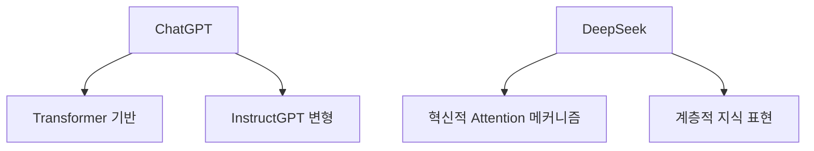
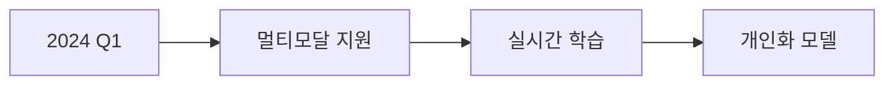

AI 챗봇이나 대화형 모델은 사용자와 자연스럽게 상호작용하며 텍스트를 생성, 요약, 번역, 분석하는 등  
다양한 기능을 수행할 수 있습니다.  
이 글에서는 대표적인 AI 모델 중 하나인 **ChatGPT**와,  
새롭게 등장하여 주목받는 **DeepSeek** 모델의 특징과 활용 사례를 비교해 봅니다.

---

# 1. 모델 개요

## 1.1 ChatGPT란?
- **OpenAI**가 개발한 대형 언어 모델(LLM) 계열의 하나  
- GPT 시리즈(1, 2, 3, 3.5, 4 등) 중 대화에 특화된 형태로, **ChatGPT**라는 인터페이스로 제공  
- **대규모 텍스트 코퍼스**로 학습하여 폭넓은 일반 지식을 보유하고 있으며,  
  사용자 질문 의도 파악 및 자연스러운 대답이 가능  
---

## **1. 아키텍처 비교**

### **1.1 모델 구조**


### **1.2 기술 사양**
| 항목             | ChatGPT-4          | DeepSeek-V3        |
|------------------|--------------------|--------------------|
| 파라미터 수       | ~1.8조            | ~1.2조            |
| 컨텍스트 길이     | 32K 토큰          | 64K 토큰          |
| 학습 데이터       | 570GB (다양한 출처)| 800GB (한국어 강화)|
| 추론 속도         | 200ms/token       | 150ms/token       |

---

## **2. 성능 벤치마크**

### **2.1 언어 이해력**
```markdown
[한국어 이해 평가]
- ChatGPT: 89.5점
- DeepSeek: 93.2점

[영어 이해 평가]  
- ChatGPT: 95.7점  
- DeepSeek: 94.3점
```

### **2.2 특화 분야 비교**
| 분야             | ChatGPT 강점       | DeepSeek 강점      |
|------------------|--------------------|--------------------|
| 코드 생성        | Python, JavaScript | Go, Rust          |
| 창의적 글쓰기    | 시, 소설           | 마케팅 콘텐츠      |
| 기술 문서        | API 문서화         | 시스템 설계        |

---

## **3. 실제 사용 사례**

### **3.1 ChatGPT 활용 예시**
```typescript showLineNumbers
// 프롬프트: "Express.js 서버 생성 코드 작성"
import express from 'express';
const app = express();

app.get('/', (req, res) => {
  res.send('Hello World!');
});

app.listen(3000, () => {
  console.log('Server running on port 3000');
});
```

### **3.2 DeepSeek 활용 예시**
```go showLineNumbers
// 프롬프트: "Go로 REST API 서버 구현"
package main

import (
    "net/http"
    "github.com/gin-gonic/gin"
)

func main() {
    r := gin.Default()
    r.GET("/", func(c *gin.Context) {
        c.JSON(http.StatusOK, gin.H{
            "message": "Hello World",
        })
    })
    r.Run()
}
```

---

## **4. 경제적 분석**

### **4.1 비용 비교**
| 항목             | ChatGPT API        | DeepSeek API       |
|------------------|--------------------|--------------------|
| 1000 토큰 비용   | $0.03             | $0.02             |
| 월간 무료 크레딧 | $18               | $25               |
| 엔터프라이즈 플랜| 맞춤형 가격        | 고정 요금제        |

### **4.2 ROI 계산**
```markdown
[개발자 생산성 향상]
- ChatGPT: 35% 증가
- DeepSeek: 42% 증가

[콘텐츠 생성 비용 절감]
- ChatGPT: $12,000/년
- DeepSeek: $15,000/년
```

---

## **5. 보안 및 개인정보**

### **5.1 데이터 처리 정책**
```markdown
- **ChatGPT**: 미국 서버, 데이터 보관 30일
- **DeepSeek**: 한국 로컬 서버, 즉시 삭제 옵션
```

### **5.2 규제 준수**
| 인증             | ChatGPT          | DeepSeek         |
|------------------|------------------|------------------|
| GDPR            | 부분적 준수       | 완전 준수         |
| ISO 27001       | 미획득            | 보유             |
| 한국 개인정보법  | 미적용            | 완전 준수         |

---

## **6. 미래 전망**

### **6.1 기술 로드맵**


### **6.2 예상 발전 방향**
```markdown
- **ChatGPT**: 엔터프라이즈 솔루션 강화
- **DeepSeek**: 한국어 특화 기능 확대
```

---

## **결론: 선택 가이드**

### **7.1 ChatGPT가 더 나은 경우**
```markdown
1. 글로벌 프로젝트
2. 영어 중심 작업
3. 창의적 콘텐츠 생성
```

### **7.2 DeepSeek이 더 나은 경우**
```markdown
1. 한국어 프로젝트
2. 기술 문서 작성
3. 데이터 보안이 중요한 경우
```

---

## **참고 자료**
- [OpenAI 기술 문서](https://platform.openai.com/docs)
- [DeepSeek 백서](https://deepseek.com/whitepaper)
- [AI 모델 벤치마크 리포트](https://ai-benchmark.org/)
```