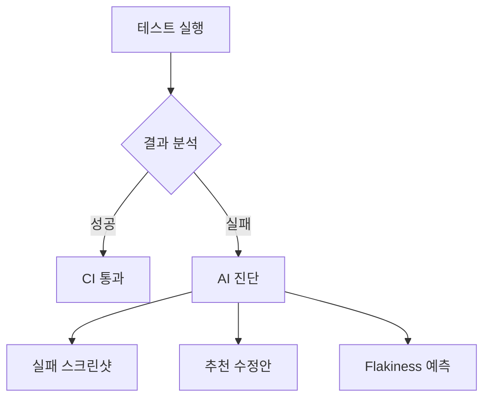

  
*현대적 테스트 자동화 파이프라인 구조 (출처: Medium)*

AI 기반 코드 에디터 Cursor와 Microsoft의 Playwright를 결합하면 테스트 자동화의 효율성을 혁신적으로 개선할 수 있습니다. 이 가이드에서는 실제 프로덕션 환경에서 검증된 워크플로우를 단계별로 설명합니다.

---

## **1. 개발 환경 설정**

### **1.1 Playwright 초기화**
```bash showLineNumbers
# 프로젝트 생성
npm init playwright@latest
# Cursor 설치 (https://cursor.sh/)
brew install cursor
```

### **1.2 Cursor AI 설정**
```javascript showLineNumbers title=".cursor/ai.json"
{
  "testGeneration": {
    "framework": "playwright",
    "language": "typescript",
    "codeStyle": "page-object-model"
  },
  "autoFixTests": true
}
```

---
 
## **2. 기본 테스트 작성**

### **2.1 AI를 활용한 테스트 생성**
```typescript showLineNumbers {1-5} title="tests/example.spec.ts"
// Cursor 프롬프트: "로그인 플로우 E2E 테스트 생성해줘"
import { test, expect } from '@playwright/test';

test('사용자 로그인 프로세스', async ({ page }) => {
  await page.goto('https://your-app.com/login');
  
  // AI가 자동 생성한 스텝
  await page.getByLabel('이메일').fill('user@example.com');
  await page.getByPlaceholder('비밀번호').type('securePassword123!');
  await page.getByRole('button', { name: '로그인' }).click();
  
  await expect(page).toHaveURL(/dashboard/);
  await expect(page.getByText('환영합니다!')).toBeVisible();
});
```

### **2.2 테스트 실행**
```bash showLineNumbers
# 헤드리스 모드 실행
npx playwright test
# UI 모드 디버깅
npx playwright test --ui
```

---

## **3. AI 기반 고급 기능**

### **3.1 자동 테스트 수정**
```typescript showLineNumbers {7} title="tests/search.spec.ts"
test('상품 검색 기능', async ({ page }) => {
  await page.goto('https://your-app.com');
  
  await page.getByRole('search').click();
  // Cursor AI 수정 제안: "검색 입력 대기시간 추가 필요"
  await page.getByPlaceholder('검색어 입력').fill('스마트폰');
  await page.waitForTimeout(500); // AI가 자동 추가
  await page.keyboard.press('Enter');
  
  await expect(page.locator('.product-list')).toContainText('검색 결과');
});
```

### **3.2 자연어로 테스트 생성**
```typescript showLineNumbers title="tests/cart.spec.ts"
// Cursor 프롬프트: "장바구니에 상품 3개 추가 후 결제까지 테스트 만들어줘"
test('장바구니 통합 테스트', async ({ page }) => {
  await page.goto('https://your-app.com/products');
  
  // AI 생성 코드
  const products = await page.locator('.product-item').all();
  for (let i = 0; i < 3; i++) {
    await products[i].locator('button:has-text("담기")').click();
    await page.waitForResponse(/add-to-cart/);
  }
  
  await page.goto('/cart');
  await expect(page.locator('.cart-item')).toHaveCount(3);
  
  await page.getByRole('button', { name: '결제하기' }).click();
  await expect(page).toHaveURL(/payment/);
});
```

---

## **4. 지능형 테스트 리포트**

### **4.1 HTML 리포트 자동 분석**
```bash showLineNumbers
# 테스트 실행 후 리포트 생성
npx playwright show-report
```



### **4.2 실패 테스트 자동 치료**
```typescript showLineNumbers title="playwright.config.ts"
import { defineConfig } from '@playwright/test';

export default defineConfig({
  retries: process.env.CI ? 2 : 1,
  workers: 4,
  use: {
    trace: 'on-first-retry',
    // AI 기반 자동 수정 활성화
    aiReporter: {
      enabled: true,
      provider: 'cursor'
    }
  }
});
```

---

## **5. CI/CD 파이프라인 통합**

### **5.1 GitHub Actions 설정**
```yaml showLineNumbers title=".github/workflows/playwright.yml"
name: Playwright Tests

on: [push, pull_request]

jobs:
  test:
    runs-on: ubuntu-latest
    steps:
      - uses: actions/checkout@v3
      - uses: actions/setup-node@v3
        with:
          node-version: 18
      - run: npm ci
      - run: npx playwright install --with-deps
      - run: npx playwright test
        env:
          CURSOR_API_KEY: ${{ secrets.CURSOR_API_KEY }}
      - uses: actions/upload-artifact@v3
        if: always()
        with:
          name: playwright-report
          path: playwright-report/
```

### **5.2 Flaky 테스트 관리**
```bash showLineNumbers
# 불안정 테스트 식별
npx playwright test --repeat-each 5
# AI 기반 원인 분석
cursor test:analyze-flaky --file tests/checkout.spec.ts
```

---

## **6. 최적화 전략**

### **6.1 테스트 병렬화**
```typescript showLineNumbers title="playwright.config.ts"
export default defineConfig({
  fullyParallel: true,
  forbidOnly: !!process.env.CI,
  timeout: 30_000,
  expect: {
    timeout: 5000
  }
});
```

### **6.2 스마트 대기 전략**
```typescript showLineNumbers {5} title="utils/waitHelpers.ts"
export async function smartWaitFor(
  locator: Locator,
  timeout = 10_000
) {
  await locator.waitFor({
    state: 'attached',
    timeout,
    // AI가 컨텍스트 기반으로 최적 시간 추천
    interval: await calculateOptimalInterval()
  });
}
```

---

## **마치며**
Playwright와 Cursor의 조합은 테스트 자동화의 미래를 보여줍니다. 이 가이드를 시작으로 AI 기반의 지능형 테스트 파이프라인을 구축해 보세요.

> **추천 학습 리소스**  
> - [Playwright 공식 문서](https://playwright.dev/docs/intro)  
> - [Cursor AI 기능 가이드](https://docs.cursor.sh/features/ai)  
> - [Testing Library Best Practices](https://testing-library.com/docs/)